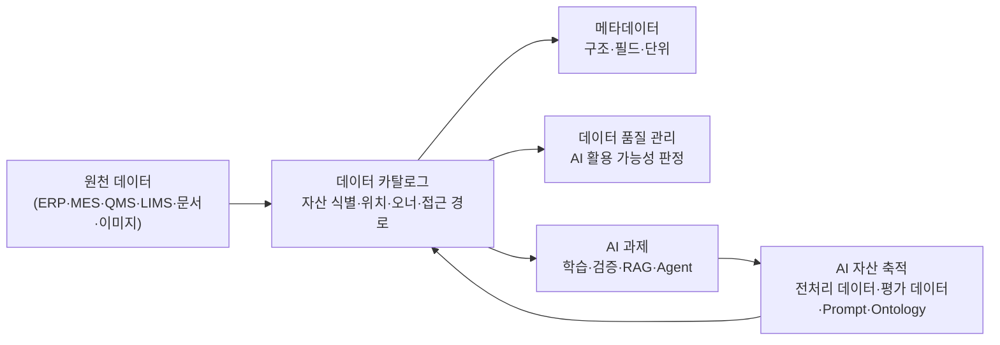

# A-1 데이터 카탈로그 가이드

# Executive Summary

데이터 카탈로그는 단순히 데이터의 위치를 기록하는 목록이 아니라, 계열사 내 데이터 자산을 체계적으로 식별·관리·재사용하기 위한 AI-ready Data 체계의 핵심 기반이다.

AI 과제 수행 시 가장 많은 시간이 소요되는 활동 중 하나는 필요한 데이터의 존재 여부를 확인하고, 위치를 파악하며, 오너와 접근 방법을 확인하는 과정이다. 데이터 카탈로그는 이러한 탐색 비용을 최소화하고, 이미 존재하는 데이터 자산을 재사용할 수 있도록 지원한다.

또한 데이터 카탈로그는 원천 데이터뿐 아니라 AI 과제 수행 과정에서 생성되는 전처리 데이터, 평가 데이터, Prompt, Ontology 등의 결과물을 지속적으로 축적하기 위한 기반 체계로 활용되어야 한다. 이를 통해 개별 AI 과제의 산출물이 일회성으로 소멸되지 않고, 계열사 및 그룹 차원의 AI 자산으로 축적될 수 있다.

본 가이드는 데이터 카탈로그의 정의, 구성 체계, 구축 방법, 운영 방식, AI 과제 연계 정책, KPI 및 고도화 Roadmap을 포함하여 정의한다.

---

## 목차

1. [개요](#1-개요)
2. [필요성 및 기대 효과](#2-필요성-및-기대-효과)
3. [구성 체계](#3-구성-체계)
4. [주요 조직 및 역할](#4-주요-조직-및-역할)
5. [데이터 현황 조사 및 등록 대상 선정](#5-데이터-현황-조사-및-등록-대상-선정)
6. [데이터 카탈로그 구축](#6-데이터-카탈로그-구축)
7. [계열사 적용 예시](#7-계열사-적용-예시)
8. [데이터 카탈로그 운영](#8-데이터-카탈로그-운영)
9. [AI 과제 연계 운영 정책](#9-ai-과제-연계-운영-정책)
10. [AI-ready 데이터 체계 내 연계 범위](#10-ai-ready-데이터-체계-내-연계-범위)
11. [KPI 및 성과 관리](#11-kpi-및-성과-관리)
12. [고도화 Roadmap](#12-고도화-roadmap)
13. [Appendix](#appendix)

> 관련 가이드: [A-2 메타데이터](A-2%20메타데이터.md) · [A-3 비즈니스 Glossary](A-3%20비즈니스%20Glossary.md) · [C-2 데이터 품질 관리](C-2%20데이터%20품질%20관리.md) · [C-3 데이터 계통 Lineage](C-3%20데이터%20계통%20Lineage.md) · [F-2 데이터 생애주기 관리](F-2%20데이터%20생애주기%20관리.md)

---

# 1. 개요

## 1.1 데이터 카탈로그의 정의

데이터 카탈로그(Data Catalog)는 조직이 보유한 데이터 자산의 존재 여부, 위치, 오너, 접근 경로 및 활용 정보를 통합 관리하는 체계이다.

데이터 카탈로그는 데이터 자체를 저장하거나 이동하는 시스템이 아니다. 데이터가 어디에 있으며, 누가 관리하고, 어떤 절차를 통해 접근할 수 있는지를 관리하는 데이터 자산 탐색 및 관리 체계이다.

도서관에서 원하는 책을 찾기 위해서는 책 자체뿐 아니라 책의 위치와 분류 체계를 제공하는 검색 시스템이 필요하다. 데이터 카탈로그는 조직 내 데이터 자산에 대한 검색 시스템과 유사한 역할을 수행한다. 데이터 사용자는 카탈로그를 통해 필요한 데이터가 존재하는지 확인하고, 데이터의 위치와 오너를 파악하며, 접근 절차를 확인할 수 있다.

데이터 카탈로그의 핵심 역할은 다음과 같다.

- 데이터 자산의 존재 여부 식별
- 데이터 자산의 저장 위치 및 접근 경로 제공
- 데이터 오너 및 관리 조직 식별
- 데이터 탐색 및 검색 지원
- 데이터 재사용 촉진
- AI 활용 대상 데이터 식별
- AI 과제 산출물 축적 기반 제공

데이터 카탈로그는 데이터의 세부 구조나 품질 자체를 모두 정의하지 않는다. 데이터 필드, 구조, 단위, 형식 등은 메타데이터 관리 체계에서 관리하며, 업무 용어의 표준 의미는 비즈니스 Glossary에서 관리한다. 데이터 품질 평가와 사용 가능 여부 판단은 데이터 품질 관리 체계와 연계하여 수행한다.

| 질문 | 담당 영역 |
|---|---|
| 이 데이터가 어디에 있는가 | 데이터 카탈로그 |
| 이 데이터의 필드·구조·단위는 무엇인가 | 메타데이터 |
| 이 업무 용어의 표준 의미는 무엇인가 | 비즈니스 Glossary |
| 이 데이터가 어디서 생성되어 어디로 흐르는가 | 데이터 Lineage |
| 이 데이터를 AI에 활용할 수 있는가 | 데이터 품질 관리 |

### 용어 정의

**데이터 자산(Data Asset)**  
조직이 업무 수행, 의사결정, 분석, AI 과제에 활용하거나 활용 가능한 모든 데이터 객체를 의미한다. ERP 테이블, MES 생산 데이터, QMS 검사 결과, LIMS 시험 데이터, 센서 로그, 보고서, 이미지, 문서 등이 모두 데이터 자산에 해당한다.

**데이터 오너(Data Owner)**  
특정 데이터 자산의 등록, 변경, 최신성 유지, 접근 정책에 대한 책임을 가지는 담당 조직 또는 담당자를 의미한다.

**데이터 스튜워드(Data Steward)**  
데이터 카탈로그 등록 품질, 분류 체계, 태그, 최신성 점검 등을 관리하는 역할이다. 계열사 상황에 따라 전담 조직이 수행할 수도 있고, 현업 또는 IT 조직이 겸임할 수도 있다.

---

## 1.2 데이터 카탈로그 구축 목적

데이터 카탈로그 구축 목적은 단순한 데이터 탐색 지원을 넘어 계열사 AI 자산화를 위한 기반 체계를 구축하는 데 있다.

### 1.2.1 데이터를 빠르게 발견하게 한다

조직 내 데이터 규모가 증가할수록 데이터 존재 여부와 위치를 파악하는 데 많은 시간이 소요된다. 특히 ERP, MES, QMS, LIMS, SharePoint, 파일 서버, 데이터레이크 등 다양한 시스템을 동시에 운영하는 제조 환경에서는 필요한 데이터가 어느 시스템에 존재하는지 파악하는 것만으로도 상당한 시간이 필요하다.

AI 과제를 수행하는 담당자가 품질 예측 모델을 개발하려는 경우, 필요한 데이터가 MES에 있는지 QMS에 있는지, 누가 관리하는지, 어떤 절차를 통해 접근 가능한지를 확인하는 과정이 반복된다. 데이터 카탈로그는 이러한 탐색 비용을 줄이고 필요한 데이터를 빠르게 찾을 수 있도록 지원한다.

### 1.2.2 데이터 재사용을 확대한다

카탈로그가 없으면 이미 존재하는 데이터가 있어도 그 사실을 알기 어렵다. 다른 조직이나 과제에서 이미 수집·정제한 데이터가 있음에도 이를 알지 못해 동일한 원천 데이터를 다시 추출하고 전처리하는 일이 반복될 수 있다.

데이터 카탈로그는 기존 데이터 자산을 가시화하여 데이터 재사용을 확대한다. 이를 통해 중복 수집과 중복 가공을 줄이고, AI 과제 수행 시 데이터 확보 기간을 단축할 수 있다.

### 1.2.3 AI 과제 수행을 가속화한다

AI 과제 초기 단계에서는 데이터 확보가 주요 병목 구간으로 작용한다. 모델링이나 분석보다 데이터 위치 파악, 오너 확인, 접근 신청, 보안 검토에 더 많은 시간이 소요되는 경우가 많다.

데이터 카탈로그는 데이터 탐색, 오너 확인, 접근 경로 확인 과정을 표준화하여 AI 과제 수행자가 실제 분석과 모델 개발에 집중할 수 있도록 지원한다.

### 1.2.4 AI 자산을 지속적으로 축적한다

데이터 카탈로그는 원천 데이터만 관리하는 체계에 머물러서는 안 된다. 향후 AI 과제 수행 과정에서 생성되는 전처리 데이터, 평가 데이터, Prompt, Ontology, Feature Dataset 등도 데이터 카탈로그와 연계하여 관리해야 한다.

이를 통해 AI 과제별 산출물이 개별 담당자나 프로젝트 폴더에 남는 것이 아니라, 조직 차원의 AI 자산으로 축적될 수 있다. 축적된 자산은 향후 유사 과제 수행 시 재사용되어 AI 과제 수행 속도와 품질을 높이는 기반이 된다.

### 1.2.5 그룹 차원의 표준 체계를 구축한다

계열사별로 데이터 관리 방식이 상이하면 그룹 차원의 AI 활용 확산이 어렵다. 동일한 유형의 데이터라도 계열사마다 명칭, 관리 방식, 오너 지정 방식, 접근 절차가 다르면 AI 과제 수행 시 매번 별도 해석과 정리가 필요하다.

데이터 카탈로그는 계열사별 데이터 관리 방식을 표준화하고 향후 그룹 차원의 AI 활용 및 데이터 자산 연계를 위한 공통 체계로 활용한다.

---

## 1.3 적용 범위

본 가이드는 데이터 자산의 존재 여부, 위치, 오너, 접근 경로 및 활용 정보를 관리하기 위한 데이터 카탈로그 구축 및 운영 체계를 대상으로 한다.

주요 적용 범위는 다음과 같다.

- 데이터 자산 등록 기준 정의
- 데이터 탐색 체계 설계
- 데이터 수집 및 연계 방식 정의
- 데이터 최신성 유지 체계 설계
- 데이터 오너 및 운영 역할 정의
- AI 활용 데이터 식별 기준 정의
- AI 과제 산출물 등록 및 재사용 체계 정의
- KPI 및 성과 관리 체계 정의
- 계열사 확산 및 고도화 Roadmap 수립

데이터 카탈로그는 인접 관리 체계와 연계하여 운영한다. 예를 들어 컬럼 단위 상세 정의는 메타데이터 관리 체계와 연결하고, 업무 용어 표준화는 비즈니스 Glossary와 연결하며, 데이터 품질 판정과 사용 가능 여부는 데이터 품질 관리 체계와 연결한다.

중요한 것은 역할의 경계이다. 데이터 카탈로그는 데이터 자산을 탐색하고 활용할 수 있도록 만드는 진입점 역할을 수행하며, 세부 품질 판정이나 계보 추적 자체를 모두 직접 수행하는 체계는 아니다.

---

## 1.4 주요 대상 조직

데이터 카탈로그는 특정 팀만의 도구가 아니라 조직 전체가 역할을 나누어 만들고 운영하는 체계이다. 특히 AI-ready Data 관점에서는 데이터 오너, 현업, IT, AI 조직, 보안 조직이 함께 참여해야 카탈로그가 실제 활용 가능한 수준으로 유지될 수 있다.

| 조직 | 주요 역할 |
|---|---|
| 지주 또는 전사 데이터 조직 | 공통 표준, 등록 기준, 운영 정책, KPI 기준 수립 |
| 계열사 데이터 조직 | 계열사 내 데이터 자산 등록, 운영, 점검, 개선 |
| 데이터 오너 | 자신이 관리하는 데이터 자산의 등록 정보 확인, 갱신, 접근 승인 |
| 데이터 스튜워드 | 등록 품질 검토, 태그·분류 관리, 미등록 자산 점검 |
| AI 조직 | AI 과제 수행 시 데이터 탐색, 활용, 신규 자산 등록 요청 |
| IT 조직 | 시스템 연계, 커넥터 구축, 권한 연동, 기술 지원 |
| 보안 조직 | 보안 등급, 접근 통제, 민감정보 관리 기준 검토 |
| 현업 조직 | 업무 관점의 데이터 활용 목적 정의, 오류 제보, 자산 재사용 |

계열사별 데이터 조직 성숙도에 따라 역할은 다르게 배분될 수 있다. 데이터 전담 조직이 없는 계열사는 초기에는 IT 조직이나 현업 부서장이 데이터 오너 및 스튜워드 역할을 겸임할 수 있다. 다만 장기적으로는 데이터 자산별 오너와 도메인별 스튜워드를 명확히 지정해야 한다.

---

## 1.5 AI-ready Data 체계 내 데이터 카탈로그의 역할

AI-ready Data 체계에서 데이터 카탈로그는 데이터 활용의 시작점 역할을 수행한다. 카탈로그에 등록되지 않은 데이터는 존재하더라도 활용되기 어렵고, AI 과제 수행자가 반복적으로 담당자를 찾아 확인해야 한다.

데이터 카탈로그는 다음 역할을 수행한다.

- AI 과제에 필요한 데이터 자산 탐색
- 데이터 오너 및 접근 경로 확인
- AI 활용 가능 데이터 후보 식별
- 전처리·평가·Prompt·Ontology 등 AI 자산 등록 기반 제공
- 계열사 데이터 자산의 표준화된 관리 기반 제공

이 구조에서 데이터 카탈로그는 단순히 데이터를 찾는 목록이 아니라 AI 과제 수행 결과를 다시 자산으로 축적하는 순환 구조의 중심에 위치한다.

---
# 2. 필요성 및 기대 효과

## 2.1 AI 과제 수행 시 주요 문제점

AI 과제 수행 과정에서 가장 많은 시간이 소요되는 활동 중 하나는 데이터 확보 단계이다. 많은 조직에서는 AI 모델 개발, 분석 알고리즘, 시스템 구현보다도 필요한 데이터를 찾고 접근 권한을 확보하는 데 더 많은 시간을 소비한다.

특히 제조 기업은 ERP, MES, QMS, LIMS, SharePoint, 파일 서버, 데이터레이크 등 다양한 시스템을 동시에 운영하기 때문에 데이터 위치와 관리 주체를 파악하는 것이 쉽지 않다.

데이터 카탈로그가 부재한 환경에서는 아래와 같은 문제가 반복적으로 발생한다.

### 문제 1. 데이터 존재 여부를 확인하기 어렵다

필요한 데이터가 존재하는지 여부를 특정 담당자의 경험과 기억에 의존하는 경우가 많다.

예를 들어 AI 과제 수행자가 품질 예측 모델을 개발하려는 경우에도 필요한 품질 데이터가 실제로 존재하는지, 어떤 시스템에 저장되어 있는지 확인하기 위해 여러 조직에 문의해야 한다.

이 과정에서 다음과 같은 문제가 발생할 수 있다.

- 데이터가 존재함에도 발견하지 못함
- 데이터가 없다고 판단하여 과제를 포기함
- 동일 데이터를 여러 조직이 각각 보유함
- 담당자 퇴사 또는 이동으로 정보 단절 발생

---

### 문제 2. 데이터 위치가 여러 시스템에 분산되어 있다

제조 기업은 다양한 업무 시스템을 운영한다.

| 시스템 | 주요 데이터 |
|---|---|
| ERP | 자재, 원가, 구매, 생산계획 |
| MES | 생산 이력, 공정 조건 |
| QMS | 품질 검사 결과 |
| LIMS | 시험·분석 데이터 |
| SharePoint | 보고서, SOP |
| 파일 서버 | 이미지, 도면 |
| Data Lake | 센서 및 로그 데이터 |

필요한 데이터가 여러 시스템에 분산되어 있기 때문에 데이터 탐색 자체가 하나의 프로젝트가 되는 경우도 존재한다.

---

### 문제 3. 데이터 오너와 접근 절차를 알기 어렵다

데이터 위치를 확인하더라도 누가 관리하는지 모르는 경우가 많다.

예를 들어 특정 품질 데이터가 존재한다는 사실을 확인했더라도 다음과 같은 문제가 발생할 수 있다.

- 누구에게 접근 권한을 요청해야 하는지 모름
- 현재 데이터 오너가 변경됨
- 부서 개편으로 관리 조직이 변경됨
- 접근 절차가 문서화되어 있지 않음

이 경우 데이터 확보까지 수일 이상의 시간이 추가로 소요될 수 있다.

---

### 문제 4. 동일 데이터를 반복적으로 수집하고 가공한다

데이터 카탈로그가 없는 조직에서는 이미 존재하는 데이터 자산을 발견하기 어렵다.

결과적으로 동일한 데이터를 여러 조직이 반복적으로 수집하고 전처리하게 된다.

예를 들어 품질 예측 과제에서 생성한 전처리 데이터가 있음에도 이후 수행되는 AI 과제에서 이를 알지 못해 동일한 작업을 다시 수행하는 경우가 발생한다.

이러한 문제는 원천 데이터뿐 아니라 AI 과제 수행 과정에서 생성되는 자산에도 동일하게 나타난다.

- 전처리 데이터
- Feature Dataset
- 평가 데이터
- Prompt
- Ontology

등이 프로젝트 종료 후 활용되지 못하고 사라지는 경우가 많다.

---

### 문제 5. AI 과제 착수가 지연된다

AI 과제 초기 단계에서 데이터 확보가 지연되면 전체 일정에도 영향을 미친다.

많은 조직에서는 데이터 확보 단계에서 전체 프로젝트 기간의 상당 부분을 소비한다.

데이터 탐색

↓

오너 확인

↓

접근 신청

↓

보안 검토

↓

데이터 확보

과정을 반복하기 때문이다.

---

## 2.2 데이터 카탈로그 구축 필요성

데이터 카탈로그는 위와 같은 문제를 해결하기 위한 기반 체계이다.

단순히 데이터를 검색하기 위한 도구가 아니라 조직 내 데이터 자산을 체계적으로 식별하고 활용하기 위한 관리 체계로 이해해야 한다.

### 데이터 증가에 따른 탐색 비용 증가

조직 내 데이터 규모는 지속적으로 증가하고 있다.

과거에는 담당자가 기억할 수 있는 수준이었지만 현재는 수백 개의 시스템과 수천 개 이상의 데이터 자산을 관리하는 경우가 많다.

데이터 규모가 증가할수록 데이터 탐색 비용은 비례적으로 증가한다.

데이터 카탈로그는 이러한 탐색 비용을 일정 수준으로 유지할 수 있도록 지원한다.

---

### AI는 사람처럼 물어볼 수 없다

사람은 필요한 데이터가 있으면 담당자에게 문의할 수 있다.

그러나 AI Agent나 RAG 시스템은 사람처럼 조직 내 담당자를 찾아 질문할 수 없다.

AI가 데이터를 활용하기 위해서는 다음 정보가 체계적으로 정리되어 있어야 한다.

- 데이터 존재 여부
- 데이터 위치
- 데이터 의미
- 접근 가능 여부
- 활용 목적

데이터 카탈로그는 AI가 활용할 수 있는 데이터 탐색 기반을 제공한다.

---

### 데이터 자산화를 위한 기반 체계가 필요하다

AI 과제가 증가할수록 데이터뿐 아니라 다양한 AI 자산이 생성된다.

대표적인 예시는 다음과 같다.

| 구분 | 예시 |
|---|---|
| 원천 데이터 | ERP, MES, QMS |
| 전처리 데이터 | Cleansing Dataset |
| Feature Dataset | 학습용 Feature |
| 평가 데이터 | Validation Dataset |
| Prompt | Prompt Template |
| Ontology | Domain Ontology |

이러한 자산이 축적되지 않으면 매번 처음부터 동일한 작업을 반복하게 된다.

데이터 카탈로그는 AI 자산의 등록 및 재사용 체계로 발전해야 한다.

---

## 2.3 기대 효과

데이터 카탈로그 구축을 통해 다음과 같은 효과를 기대할 수 있다.

### 데이터 탐색 시간 단축

필요한 데이터의 위치와 오너를 즉시 확인할 수 있다.

---

### 데이터 재사용 확대

기존 데이터 자산을 활용하여 중복 작업을 줄일 수 있다.

---

### AI 과제 수행 속도 향상

데이터 확보에 소요되는 시간을 줄이고 실제 분석과 모델 개발에 집중할 수 있다.

---

### 데이터 운영 효율화

데이터 오너와 책임 체계를 명확히 하여 운영 효율을 높일 수 있다.

---

### AI 자산 축적

전처리 데이터, 평가 데이터, Prompt, Ontology 등을 지속적으로 축적할 수 있다.

---

### 계열사 표준 체계 구축

계열사 간 동일한 기준으로 데이터 자산을 관리할 수 있다.

---

## 2.4 기대 효과 요약

| 구분 | As-Is | To-Be |
|---|---|---|
| 데이터 탐색 | 담당자 문의 중심 | 검색 중심 |
| 데이터 확보 | 수일 소요 | 수시간 이내 |
| 데이터 재사용 | 낮음 | 높음 |
| AI 과제 착수 | 지연 발생 | 신속 착수 |
| AI 자산 관리 | 프로젝트 단위 | 조직 단위 |
| 계열사 운영 | 개별 운영 | 표준 운영 |

---

## 2.5 데이터 카탈로그의 핵심 가치

데이터 카탈로그의 최종 목표는 단순한 데이터 검색 기능 제공이 아니다.

조직 내 데이터와 AI 자산을 지속적으로 축적하고 재사용할 수 있는 기반 체계를 구축하는 것이다.

이를 통해 신규 AI 과제 수행 시 기존 자산 활용 비중을 지속적으로 확대할 수 있으며, 장기적으로는 AI Agent가 기존 자산을 자동 탐색하고 활용할 수 있는 구조로 발전할 수 있다.

데이터 카탈로그는 이러한 AI-ready Data 체계의 출발점 역할을 수행한다.

---
