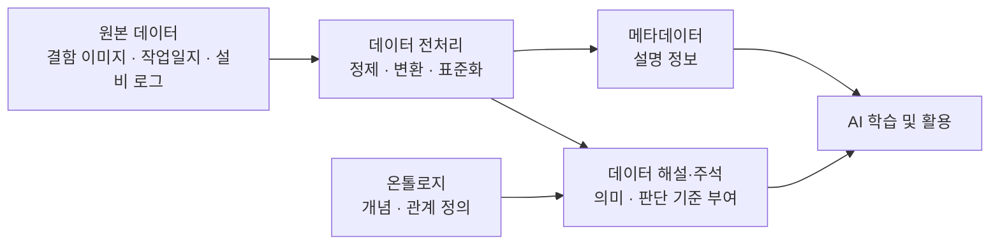

# B-2. 데이터 해설·주석 매뉴얼


## 목차

1. [개요](#1-개요)
   - [1.1 데이터 해설·주석이란](#11-데이터-해설주석이란)
   - [1.2 메타데이터, 온톨로지, 데이터 해설·주석의 차이](#12-메타데이터-온톨로지-데이터-해설주석의-차이)
   - [1.3 데이터 전처리, 온톨로지, 데이터 해설·주석의 관계](#13-데이터-전처리-온톨로지-데이터-해설주석의-관계)
   - [1.4 주요 대상 조직](#14-주요-대상-조직)

2. [왜 필요한가 (Why)](#2-왜-필요한가-why)
   - [2.1 데이터 해설·주석의 핵심 목적](#21-데이터-해설주석의-핵심-목적)
   - [2.2 현업 Pain Point](#22-현업-pain-point)
   - [2.3 데이터 해설·주석 적용 효과](#23-데이터-해설주석-적용-효과)
   - [2.4 자회사 관점 기대 효과](#24-자회사-관점-기대-효과)
   - [2.5 데이터 해설·주석이 필요한 데이터](#25-데이터-해설주석이-필요한-데이터)
   - [2.6 AI-ready Data 체계 내 역할 구분](#26-ai-ready-data-체계-내-역할-구분)

3. [무엇을 갖추나 (What)](#3-무엇을-갖추나-what)
   - [3.1 데이터 라벨링 (Labeling)](#31-데이터-라벨링-labeling)
   - [3.2 데이터 주석 (Annotation)](#32-데이터-주석-annotation)
   - [3.3 Annotation 유형](#33-annotation-유형)
   - [3.4 Text Annotation](#34-text-annotation)
   - [3.5 Image Annotation](#35-image-annotation)
   - [3.6 Video Annotation](#36-video-annotation)
   - [3.7 Audio Annotation](#37-audio-annotation)
   - [3.8 Taxonomy(분류 체계)](#38-taxonomy분류-체계)
   - [3.9 Taxonomy 구조 유형](#39-taxonomy-구조-유형)

4. [어디부터 하나 — 주석 대상 선정](#4-어디부터-하나--주석-대상-선정)
   - [4.1 주석 대상 선정 원칙](#41-주석-대상-선정-원칙)
   - [4.2 주요 대상 데이터](#42-주요-대상-데이터)
   - [4.3 우선순위 선정](#43-우선순위-선정)
   - [4.4 자회사 적용 시 기대 효과](#44-자회사-적용-시-기대-효과)

5. [예시 시나리오: 두산전자 결함 이미지 주석](#5-예시-시나리오-두산전자-결함-이미지-주석)
   - [5.1 적용 배경](#51-적용-배경)
   - [5.2 대상 데이터 선정](#52-대상-데이터-선정)
   - [5.3 Taxonomy 설계](#53-taxonomy-설계)
   - [5.4 Annotation Guideline 작성](#54-annotation-guideline-작성)
   - [5.5 Pilot Annotation](#55-pilot-annotation)
   - [5.6 본 Annotation 수행](#56-본-annotation-수행)
   - [5.7 AI 보조 Annotation 적용](#57-ai-보조-annotation-적용)
   - [5.8 AI 자산화](#58-ai-자산화)
   - [5.9 사례의 의미](#59-사례의-의미)

6. [어떻게 준비·운영하나 (How)](#6-어떻게-준비운영하나-how)
   - [6.1 대상 데이터 선정](#61-대상-데이터-선정)
   - [6.2 Taxonomy 설계](#62-taxonomy-설계)
   - [6.3 Annotation Guideline 작성](#63-annotation-guideline-작성)
   - [6.4 Pilot Annotation](#64-pilot-annotation)
   - [6.5 IAA 측정 및 Guideline 보정](#65-iaa-측정-및-guideline-보정)
   - [6.6 Labeler 합의 체계](#66-labeler-합의-체계)
   - [6.7 Gold Standard Dataset 구축](#67-gold-standard-dataset-구축)
   - [6.8 본 Annotation 수행](#68-본-annotation-수행)
   - [6.9 QA 및 검수](#69-qa-및-검수)
   - [6.10 AI 기반 Annotation 자동화](#610-ai-기반-annotation-자동화)
   - [6.11 Pre-labeling](#611-pre-labeling)
   - [6.12 Human-in-the-Loop(HITL)](#612-human-in-the-loophitl)
   - [6.13 Active Learning](#613-active-learning)
   - [6.14 Weak Supervision](#614-weak-supervision)
   - [6.15 Annotation 데이터셋 버전 관리](#615-annotation-데이터셋-버전-관리)

7. [다른 주제와의 관계](#7-다른-주제와의-관계)
   - [7.1 데이터 전처리와의 관계](#71-데이터-전처리와의-관계)
   - [7.2 메타데이터와의 관계](#72-메타데이터와의-관계)
   - [7.3 비즈니스 Glossary와의 관계](#73-비즈니스-glossary와의-관계)
   - [7.4 온톨로지와의 관계](#74-온톨로지와의-관계)
   - [7.5 데이터 품질 관리와의 관계](#75-데이터-품질-관리와의-관계)
   - [7.6 AI 평가 데이터와의 관계](#76-ai-평가-데이터와의-관계)

8. [KPI 및 성과 관리](#8-kpi-및-성과-관리)
   - [8.1 KPI 운영 원칙](#81-kpi-운영-원칙)
   - [8.2 품질 KPI](#82-품질-kpi)
   - [8.3 생산성 KPI](#83-생산성-kpi)
   - [8.4 운영 KPI](#84-운영-kpi)
   - [8.5 자동화 KPI](#85-자동화-kpi)
   - [8.6 KPI 활용 단계](#86-kpi-활용-단계)
   - [8.7 자회사 적용 시 기대 효과](#87-자회사-적용-시-기대-효과)

9. [Roadmap](#9-roadmap)
   - [9.1 추진 방향](#91-추진-방향)
   - [Phase 1. Preparation](#phase-1-preparation)
   - [Phase 2. AI Ready](#phase-2-ai-ready)
   - [Phase 3. Automation](#phase-3-automation)
   - [Phase 4. AI Assetization](#phase-4-ai-assetization)
   - [9.2 자회사 적용 가이드](#92-자회사-적용-가이드)
   - [9.3 최종 목표](#93-최종-목표)

10. [Appendix](#appendix)
   - [주요 용어](#주요-용어)
---
# Executive Summary

데이터 해설·주석은 AI가 데이터를 올바르게 이해하고 학습할 수 있도록 사람의 판단 기준과 의미 정보를 데이터에 부여하는 활동이다.

AI 모델의 성능은 알고리즘 자체보다 학습 데이터 품질의 영향을 크게 받는다. 동일한 데이터를 사용하더라도 라벨 기준이 일관되지 않거나 판단 근거가 명확하지 않으면 모델은 잘못된 패턴을 학습할 수 있으며, 이는 예측 정확도 저하와 운영 신뢰도 저하로 이어질 수 있다.

특히 제조 환경에서는 결함 이미지, 고객 클레임, 설비 점검 기록, 작업 일지와 같이 사람의 해석이 필요한 데이터가 다수 존재한다. 이러한 데이터는 원천 데이터만으로는 AI가 의미를 이해하기 어렵기 때문에, 데이터 해설·주석을 통해 의미 정보와 판단 기준을 명시적으로 부여해야 한다.

본 가이드는 데이터 해설·주석 체계를 구축하기 위해 필요한 주석 대상 선정, Taxonomy 설계, Annotation Guideline 작성, 품질 검증, 데이터셋 운영 및 자동화 방안을 정의한다.

이를 통해 계열사는 AI 학습 데이터 품질을 향상시키고, 주석 데이터셋을 재사용 가능한 자산으로 축적할 수 있다.

---

# 1. 개요

## 1.1 데이터 해설·주석이란

데이터 해설·주석(Data Annotation)은 AI가 데이터를 이해하고 학습할 수 있도록 데이터에 의미 정보를 부여하는 작업이다.

AI는 원본 데이터만으로는 데이터가 무엇을 의미하는지 스스로 이해하지 못한다. 예를 들어 결함 사진이 주어지더라도 AI는 해당 사진이 정상인지 불량인지, 어떤 유형의 결함인지, 어느 위치에 존재하는지 알 수 없다.

따라서 사람이 데이터에 의미 정보를 부여해야 하며, 이를 데이터 해설·주석이라고 한다.

예를 들어 결함 사진 한 장에 다음과 같은 정보를 추가할 수 있다.

| 구분 | 예시 |
|---|---|
| 결함 여부 | 불량 |
| 결함 유형 | 스크래치 |
| 결함 위치 | 외경 테두리 |
| 심각도 | 중 |
| 권장 조치 | 재가공 필요 |

이와 같이 원본 데이터에 사람이 해석한 의미 정보를 추가함으로써 AI가 학습 가능한 데이터로 전환된다.

---

## 1.2 메타데이터, 온톨로지, 데이터 해설·주석의 차이

AI가 데이터를 활용하기 위해서는 데이터 자체뿐 아니라 데이터를 설명하고 해석하기 위한 다양한 정보가 필요하다.

대표적으로 메타데이터, 온톨로지, 데이터 해설·주석은 모두 데이터 이해를 지원하지만 목적과 역할은 서로 다르다.

### 메타데이터

메타데이터(Metadata)는 데이터를 설명하기 위한 정보이다.

데이터의 생성 시점, 저장 위치, 담당 조직, 컬럼 정의 등 데이터 자체를 이해하고 관리하기 위한 정보를 제공한다.

즉, 메타데이터는 데이터가 **어떤 데이터인지**를 설명한다.

예를 들어 동일한 결함 이미지에 대해 다음과 같은 정보는 메타데이터에 해당한다.

- 촬영일시
- 설비 ID
- 제품명
- 파일 형식
- 해상도
- 저장 위치

---

### 온톨로지

온톨로지(Ontology)는 업무 개념과 개념 간 관계를 정의하는 체계이다.

개별 데이터를 설명하는 것이 아니라 업무 지식을 구조화하여 AI가 개념 간 관계를 이해할 수 있도록 지원한다.

예를 들어

```text
스크래치
→ 표면 결함

스크래치
→ 원인
→ 롤러 마모

스크래치
→ 조치
→ 재가공
```

와 같이 개념과 관계를 정의한다.

즉, 온톨로지는 **업무 개념이 서로 어떻게 연결되는가**를 설명한다.

---

### 데이터 해설·주석

데이터 해설·주석(Data Annotation / Labelling)은 AI 학습과 판단을 위해 데이터에 의미와 정답 정보를 부여하는 작업이다.

예를 들어 특정 결함 이미지에 대해

- 결함 유형 = 스크래치
- 결함 위치 = 외경 테두리
- 심각도 = 중
- 권장 조치 = 재가공

과 같은 정보를 부여하는 것이 데이터 해설·주석이다.

즉, 데이터 해설·주석은 **이 데이터를 어떻게 해석하고 판단해야 하는가**를 설명한다.

---

### 비교

| 구분 | 메타데이터 | 온톨로지 | 데이터 해설·주석 |
|---|---|---|---|
| 목적 | 데이터 설명 | 개념 및 관계 정의 | 의미 및 정답 부여 |
| 주요 질문 | 이 데이터는 무엇인가? | 이 개념은 무엇과 연결되는가? | 이 데이터를 어떻게 판단해야 하는가? |
| 대상 | 데이터 자체 | 업무 개념 | 개별 데이터 |
| 예시 | 생성일시, 위치, 담당자 | 결함 → 원인 → 조치 | 결함 유형, 심각도, 위치 |

메타데이터는 데이터를 설명하고, 온톨로지는 업무 개념을 구조화하며, 데이터 해설·주석은 개별 데이터에 의미를 부여한다.

---

## 1.3 데이터 전처리, 온톨로지, 데이터 해설·주석의 관계

데이터 전처리, 온톨로지, 데이터 해설·주석은 모두 AI가 데이터를 올바르게 이해할 수 있도록 지원하지만 서로 다른 역할을 수행한다.



데이터 전처리는 원본 데이터를 AI가 처리할 수 있는 형태로 정리하는 역할을 수행한다.

예를 들어 이미지 크기를 통일하거나, 결측치를 제거하거나, 문서 데이터를 텍스트로 변환하는 작업이 이에 해당한다.

온톨로지는 업무 개념과 개념 간 관계를 정의한다.

예를 들어 결함 유형, 원인, 조치 간 관계를 정의하여 어떤 기준으로 데이터를 해석할 것인지를 제공한다.

데이터 해설·주석은 전처리된 데이터에 온톨로지와 업무 기준을 적용하여 개별 데이터에 의미 정보를 부여한다.

예를 들어 특정 결함 이미지에 대해

- 결함 유형 = 스크래치
- 위치 = 외경 테두리
- 심각도 = 중

과 같은 Annotation을 생성한다.

결과적으로 데이터 전처리는 데이터의 형태를 준비하고, 온톨로지는 판단 기준을 제공하며, 데이터 해설·주석은 개별 데이터에 의미를 부여한다.

이 세 가지 요소가 함께 작동해야 AI가 데이터를 올바르게 이해하고 활용할 수 있다.
## 1.5 주요 대상 조직

데이터 해설·주석은 특정 조직만 수행하는 활동이 아니다.

주석 기준 정의, 실제 주석 수행, 품질 검수, AI 활용까지 다양한 조직이 함께 참여한다.

| 조직/역할 | 주요 역할 |
|---|---|
| 지주/전사 데이터 조직 | 주석 표준 및 운영 기준 수립 |
| 현업 전문가(SME) | 분류 기준 및 판단 기준 정의 |
| 데이터 라벨러 | 실제 라벨 및 주석 수행 |
| 검수자(QA) | 품질 검수 및 일치도 관리 |
| AI/데이터 조직 | AI 학습 및 자동화 체계 구축 |

현업 전문가의 역할이 특히 중요하다.

주석은 단순 입력 작업이 아니라 업무 지식을 데이터에 반영하는 과정이기 때문에, 도메인 전문가의 판단 기준이 반드시 반영되어야 한다.

---

# 2. 왜 필요한가 (Why)

AI 모델의 성능은 알고리즘보다 학습 데이터 품질의 영향을 크게 받는다.

동일한 모델을 사용하더라도 학습 데이터가 정확하고 일관되게 구축되어 있으면 높은 성능을 확보할 수 있지만, 데이터에 대한 해석 기준이 불명확하거나 라벨 품질이 낮으면 모델은 잘못된 패턴을 학습하게 된다.

특히 제조 환경에서는 결함 이미지, 고객 클레임, 작업 일지, 설비 점검 기록과 같이 사람의 해석이 필요한 데이터가 많다.

이러한 데이터는 원천 데이터만으로는 AI가 의미를 이해하기 어렵기 때문에, 사람의 판단 기준을 체계적으로 부여하는 데이터 해설·주석 체계가 필요하다.

---

## 2.1 데이터 해설·주석의 핵심 목적

데이터 해설·주석 체계는 단순히 라벨을 붙이는 작업이 아니라, AI가 데이터를 일관되게 이해할 수 있도록 만드는 기반 체계이다.

주요 목적은 다음과 같다.

### 데이터 의미 및 판단 기준 표준화

제품, 공정, 결함, 원인, 조치 등 핵심 업무 개념에 대한 해석 기준을 표준화한다.

이를 통해 동일한 데이터를 여러 사람이 보더라도 동일한 의미로 해석할 수 있도록 한다.

---

### 신뢰 가능한 AI 학습 환경 구축

표준화된 주석 기준과 검수 체계를 기반으로 AI 학습에 활용 가능한 고품질 데이터셋을 구축한다.

이를 통해 AI 모델이 잘못된 데이터를 학습하는 위험을 줄이고, 예측 결과의 신뢰도를 높일 수 있다.

---

### 주석 품질 및 이력 관리 체계 구축

주석 결과뿐 아니라 누가, 언제, 어떤 기준으로 주석을 생성했는지 추적 가능하도록 관리한다.

이를 통해 데이터 품질 문제 발생 시 원인을 추적하고 개선할 수 있다.

---

## 2.2 현업 Pain Point

많은 AI 과제는 모델 개발보다 학습 데이터 준비 단계에서 더 많은 시간과 비용이 소요된다.

대표적인 문제는 다음과 같다.

### 데이터 의미와 업무 맥락에 대한 표준 정의 부재

동일한 현상을 사람마다 다르게 해석하는 경우가 많다.

예를 들어 동일한 결함에 대해

- 스크래치
- 긁힘
- 표면 결함

등 서로 다른 표현을 사용할 수 있다.

이 경우 AI는 동일한 현상을 서로 다른 데이터로 학습하게 된다.

---

### 주석 기준 부재로 인한 품질 편차

주석 기준이 명확하지 않으면 동일한 데이터에 대해서도 작업자마다 다른 결과가 생성될 수 있다.

예를 들어 동일한 결함 사진을 보고

- 작업자 A는 크랙
- 작업자 B는 스크래치

로 분류할 수 있다.

이러한 불일치는 학습 데이터 품질을 저하시킨다.

---

### 주석 품질 및 변경 이력 관리 미흡

주석 데이터가 수정되더라도 변경 이력이 관리되지 않는 경우가 많다.

이 경우

- 어떤 기준으로 수정되었는지
- 어느 버전의 데이터가 모델 학습에 사용되었는지

확인하기 어렵다.

---

### AI 과제별 데이터 재작업 반복

과거 AI 과제에서 생성한 데이터셋이 존재함에도 재사용되지 못하는 경우가 많다.

그 결과

- 동일한 라벨링 반복
- 동일한 검수 반복
- 동일한 데이터 정제 반복

이 발생한다.

---

## 2.3 데이터 해설·주석 적용 효과

데이터 해설·주석 체계를 구축하면 다음과 같은 효과를 기대할 수 있다.

### 기계가 이해할 수 있는 데이터로 전환

원천 데이터에 의미 정보를 부여하여 AI가 학습 가능한 형태로 전환한다.

예를 들어 결함 사진은 단순 이미지 파일이지만,

주석을 통해

- 결함 유형
- 위치
- 심각도

가 추가되면 AI 학습 데이터가 된다.

---

### AI 학습 효율 향상

일관된 주석 기준을 적용하면 모델이 더 빠르게 학습하고 높은 정확도를 확보할 수 있다.

또한 데이터 품질 문제로 인한 재학습 비용을 줄일 수 있다.

---

### 데이터 재사용성 향상

표준화된 데이터셋은 여러 AI 과제에서 반복 활용할 수 있다.

예를 들어

품질 검사 데이터셋은

- 불량 분류 모델
- 결함 원인 분석
- 이상 탐지 모델

등 다양한 AI 과제에 활용 가능하다.

---

### AI 자산화 기반 구축

주석 데이터는 단순한 프로젝트 산출물이 아니라 재사용 가능한 AI 자산이다.

한 번 구축한 데이터셋은 지속적으로 축적하고 활용할 수 있어야 한다.

---

## 2.4 자회사 관점 기대 효과

자회사가 본 가이드를 적용하면 다음과 같은 효과를 기대할 수 있다.

| 구분 | 기대 효과 |
|---|---|
| 데이터 품질 | 주석 기준 표준화 |
| AI 성능 | 모델 정확도 및 신뢰도 향상 |
| 운영 효율 | 재작업 감소 |
| 비용 절감 | 데이터 구축 비용 절감 |
| 재사용성 | 데이터셋 재활용 가능 |
| 자산화 | AI 자산 지속 축적 |

---

## 2.5 데이터 해설·주석이 필요한 데이터

모든 데이터가 주석 대상은 아니다.

AI가 의미와 판단 기준을 직접 이해하기 어려운 데이터를 우선 대상으로 선정한다.

대표적인 대상은 다음과 같다.

| 데이터 유형 | 예시 |
|---|---|
| Text | 작업일지, 고객 클레임 |
| Image | 결함 이미지, 제품 사진 |
| Video | 작업 영상, 설비 영상 |
| Audio | 설비 이상음, 음성 기록 |

반대로 ERP 마스터 데이터처럼 의미가 이미 구조화되어 있는 데이터는 일반적으로 별도의 Annotation 대상이 아니다.

---

## 2.6 AI-ready Data 체계 내 역할 구분

데이터 해설·주석은 AI-ready Data 체계 내 다른 주제와 명확히 역할을 구분해야 한다.

| 주제 | 역할 |
|---|---|
| 데이터 전처리 | 데이터를 AI가 읽을 수 있도록 정리 |
| 데이터 해설·주석 | 의미와 판단 기준 부여 |
| 메타데이터 | 데이터 설명 정보 관리 |
| 온톨로지 | 개념 간 관계 정의 |
| 데이터 품질 관리 | AI 활용 가능 여부 평가 |

즉 데이터 해설·주석은 "데이터에 의미를 부여하는 역할"에 집중한다.

---

# 3. 무엇을 갖추나 (What)

데이터 해설·주석 체계는 AI가 데이터를 이해하고 학습할 수 있도록 의미 정보를 부여하는 체계이다.

본 가이드에서는 데이터 해설·주석 체계를 크게 다음 두 단계로 구분한다.

1. 데이터 라벨링(Labeling)
2. 데이터 주석(Annotation)

데이터 라벨링은 데이터 전체에 대한 분류 결과를 정의하는 활동이며, 데이터 주석은 해당 데이터에 대한 세부 속성과 맥락 정보를 추가하는 활동이다.

---

## 3.1 데이터 라벨링(Labeling)

데이터 라벨링은 데이터 전체에 대해 표준 분류 체계를 적용하는 활동이다.

AI 모델 학습에서는 라벨이 정답(Ground Truth)의 역할을 수행한다.

예를 들어 결함 이미지 한 장에 대해

- 정상
- 불량

을 부여하는 것이 가장 단순한 라벨링이다.

조금 더 세분화하면

- 스크래치
- 크랙
- 찍힘
- 오염

등으로 분류할 수 있다.

### 데이터 라벨링 예시

| 데이터 | 라벨 |
|---|---|
| 결함 이미지 | 스크래치 |
| 고객 클레임 | 배송 불만 |
| 설비 로그 | 이상 |
| 작업 일지 | 정비 작업 |

---

### 라벨 형태

라벨은 AI 과제 특성에 따라 다양한 형태로 구성될 수 있다.

#### 분류 라벨

정해진 범주 중 하나를 선택

예)

- 정상
- 경고
- 고장

---

#### 다중 클래스 라벨

여러 종류의 결함 또는 상태를 구분

예)

- 크랙
- 스크래치
- 찍힘
- 오염

---

#### 수치 라벨

연속적인 값을 표현

예)

- 심각도 1~5
- 위험도 0~100

---

#### 조치 라벨

권장 조치 정의

예)

- 재가공
- 폐기
- 재검사

---

## 3.2 데이터 주석(Annotation)

주석은 라벨만으로 표현하기 어려운 세부 정보와 맥락 정보를 추가하는 활동이다.

예를 들어

"스크래치"

라는 라벨만으로는

- 어디에 존재하는지
- 얼마나 심각한지
- 어떤 원인인지

를 알 수 없다.

이러한 정보를 구조화하여 추가하는 것이 Annotation이다.

---

### Annotation 예시

| 항목 | 예시 |
|---|---|
| 위치 | 외경 테두리 |
| 원인 | 소재 불량 |
| 심각도 | 중 |
| 부품 | 베어링 |
| 시간 | 2026-05-25 10:23 |

---

### 라벨과 주석의 차이

| 구분 | 라벨 | 주석 |
|---|---|---|
| 역할 | 분류 | 세부 설명 |
| 수준 | 데이터 전체 | 데이터 일부 |
| 예시 | 스크래치 | 위치=외경, 심각도=중 |

---

## 3.3 Annotation 유형

주석 대상 데이터는 크게 네 가지 유형으로 구분할 수 있다.

| 유형 | 예시 |
|---|---|
| Text | 작업일지, 고객 클레임 |
| Image | 결함 이미지 |
| Video | 생산 영상 |
| Audio | 설비 이상음 |

---

## 3.4 Text Annotation

Text Annotation은 텍스트 데이터에 의미 정보를 부여하는 작업이다.

### NER (Named Entity Recognition)

문서 내 주요 개체를 식별

예)

- 설비명
- 부품명
- 불량 유형

---

### Span Annotation

특정 구간에 의미 부여

예)

원인 분석 구간

조치 구간

---

### Relation Extraction

개체 간 관계 정의

예)

결함 → 원인

원인 → 조치

---

### Document Classification

문서 전체 분류

예)

- 품질 보고서
- 장애 보고서
- 작업 일지

---

## 3.5 Image Annotation

Image Annotation은 제조업에서 가장 많이 활용되는 주석 방식이다.

### Image Classification

이미지 전체에 라벨 부여

예)

정상

불량

---

### Bounding Box

객체 위치를 사각형으로 표시

적용 예

- 결함 탐지
- 부품 인식

---

### Polygon

객체 외곽선을 정밀하게 표시

적용 예

- 균열 영역 측정
- 부식 영역 측정

---

### Semantic Mask

모든 픽셀을 분류

적용 예

- 영역 분석
- 정밀 분할

---

### Keypoint

특정 위치를 좌표로 표시

적용 예

- 작업자 자세 분석
- 구조물 위치 분석

---

## 3.6 Video Annotation

Video Annotation은 시간 정보를 포함하는 주석 방식이다.

대표 유형

- Frame Classification
- Object Tracking
- Action Annotation
- Event Annotation
- Temporal Segment

---

## 3.7 Audio Annotation

Audio Annotation은 음성 및 소리 데이터에 의미를 부여하는 작업이다.

대표 유형

- Sound Event Annotation
- Speech-to-Text
- Speaker Annotation
- Intent Annotation
- Emotion Annotation

---

## 3.8 Taxonomy(분류 체계)

AI 학습을 위해서는 표준 분류 체계가 필요하다.

Taxonomy는 데이터를 중복 없이 일관되게 분류하기 위한 구조이다.

좋은 Taxonomy는 아래 세 가지 원칙을 만족해야 한다.

### 상호배타성

동일 데이터는 하나의 범주로 분류되어야 한다.

---

### 포괄성

모든 데이터가 적절한 범주를 가져야 한다.

---

### 일관성

동일 데이터는 항상 동일 기준으로 분류되어야 한다.

---

## 3.9 Taxonomy 구조 유형

### Flat

단일 레벨 구조

예)

정상

경고

고장

---

### Hierarchical

계층 구조

예)

설비 상태

→ 경고

→ 고장

→ 베어링 고장

---

### Multi-label

하나의 데이터에 여러 라벨 허용

예)

경고

+

온도 이상

+

베어링 이상

---

# 4. 어디부터 하나 — 주석 대상 선정

모든 데이터를 Annotation 대상으로 삼을 필요는 없다.

AI가 직접 의미와 판단 기준을 이해하기 어려운 데이터를 우선 대상으로 선정한다.

---

## 4.1 주석 대상 선정 원칙

다음 기준을 만족하는 데이터를 우선 대상으로 선정한다.

### 의미 해석이 필요한가

AI가 스스로 이해하기 어려운 데이터인가

---

### 사람의 판단이 필요한가

전문가의 해석 기준이 필요한가

---

### AI 활용 가치가 높은가

향후 AI 과제에 활용될 가능성이 높은가

---

### 재사용 가능한가

여러 과제에서 활용 가능한가

---

## 4.2 주요 대상 데이터

### Text

작업일지

고객 클레임

정비 이력

보고서

---

### Image

설비 사진

불량 이미지

도면

---

### Video

생산 영상

작업 영상

CCTV

---

### Audio

설비 이상음

작업자 음성

고객 상담 음성

---

## 4.3 우선순위 선정

우선순위는 다음 기준으로 평가한다.

| 평가 항목 | 설명 |
|---|---|
| AI 활용도 | AI 과제 활용 가능성 |
| 업무 중요도 | 업무 영향도 |
| 데이터 규모 | 확보 가능 데이터 양 |
| 구축 난이도 | Annotation 난이도 |
| 재사용성 | 활용 범위 |

---

## 4.4 자회사 적용 시 기대 효과

주석 대상 데이터를 우선 선정하면 다음 효과를 기대할 수 있다.

- 데이터 구축 비용 절감
- AI 과제 수행 기간 단축
- 데이터 품질 향상
- 재사용 가능한 데이터셋 확보
- AI 자산 축적 기반 구축

---

# 5. 예시 시나리오: 두산전자 결함 이미지 주석

본 장에서는 두산전자 외관 검사 데이터를 예시로 데이터 해설·주석 체계가 실제로 어떻게 구축되고 운영되는지 설명한다.

데이터 해설·주석은 단순히 라벨을 부여하는 작업이 아니라, AI가 데이터를 일관되게 이해할 수 있도록 판단 기준을 표준화하고, 이를 재사용 가능한 학습 데이터 자산으로 전환하는 과정이다.

본 사례는 이후 6장에서 설명하는 구축 방법론을 실제 제조 환경에 적용한 예시로 이해할 수 있다.

---

## 5.1 적용 배경

두산전자는 생산 과정에서 다양한 외관 결함 검사를 수행한다.

현재는 검사원이 결함 이미지를 확인한 후 정상 여부와 결함 유형을 기록한다.

그러나 동일한 결함에 대해서도 검사원마다 표현과 판단 기준이 다를 수 있으며, 이러한 데이터는 AI 학습에 직접 활용하기 어렵다.

예를 들어 동일한 결함에 대해 다음과 같이 서로 다른 표현이 사용될 수 있다.

| 작업자 | 표현 |
|---|---|
| A | 스크래치 |
| B | 긁힘 |
| C | 표면 손상 |

AI 입장에서는 동일한 결함임에도 서로 다른 데이터로 인식될 수 있다.

---

## 5.2 대상 데이터 선정

AI 활용 가치와 데이터 확보 가능성을 고려하여 Annotation 대상을 선정한다.

### 후보 데이터

| 데이터 | 활용 목적 |
|---|---|
| 외관 검사 이미지 | 결함 자동 분류 |
| 고객 클레임 | VOC 분석 |
| 설비 점검 일지 | 원인 분석 |

우선순위 평가 결과, 외관 검사 이미지를 1차 Annotation 대상으로 선정하였다.

| 데이터 | AI 활용도 | 데이터 규모 | 구축 난이도 | 우선순위 |
|---|---|---|---|---|
| 외관 검사 이미지 | 높음 | 높음 | 중간 | 1 |
| 고객 클레임 | 높음 | 중간 | 높음 | 2 |
| 설비 점검 일지 | 중간 | 낮음 | 높음 | 3 |

---

## 5.3 Taxonomy 설계

현업 SME와 품질팀이 참여하여 결함 분류 체계를 정의한다.

### 기존 상태

| 표현 |
|---|
| 긁힘 |
| 스크래치 |
| 표면 손상 |

### 표준 Taxonomy 정의

```text
결함 유형
 ├ 스크래치
 ├ 크랙
 ├ 찍힘
 └ 오염
```

### Label Definition 작성

| Label | 정의 |
|---|---|
| 스크래치 | 표면의 선형 긁힘 결함 |
| 크랙 | 재질의 균열 결함 |
| 찍힘 | 외부 충격에 의한 압흔 |
| 오염 | 이물질 또는 오염 물질 부착 |

---

## 5.4 Annotation Guideline 작성

Taxonomy만으로는 작업자 간 일관성을 확보하기 어렵다.

따라서 Annotation Guideline을 작성한다.

### 스크래치 예시

#### 정답 사례

- 표면 긁힘
- 선형 흔적

#### 오답 사례

- 균열
- 파손

#### Decision Rule

```text
IF 선형 흔적 존재
AND 균열 없음

THEN 스크래치

ELSE SME 검토
```

#### Boundary Case

스크래치와 크랙이 동시에 의심되는 경우

→ SME 검토 대상으로 분류

---

## 5.5 Pilot Annotation

본 작업 이전에 Pilot Annotation을 수행한다.

### Pilot 규모

- 샘플 데이터 500건
- Annotator 3명
- Reviewer 1명

### 수행 결과

| Label | Cohen's κ |
|---|---|
| 스크래치 | 0.84 |
| 크랙 | 0.71 |
| 찍힘 | 0.88 |
| 오염 | 0.82 |

### 문제 발견

크랙과 스크래치의 구분 기준이 작업자마다 다르게 해석됨

### 개선 조치

- Guideline 보완
- 예시 추가
- Boundary Case 정의

---

## 5.6 본 Annotation 수행

Pilot 결과를 반영하여 전체 데이터셋 Annotation을 수행한다.

### 대상 데이터

| 항목 | 규모 |
|---|---|
| 이미지 수 | 50,000 |
| Label 수 | 4 |
| Annotator | 5명 |
| Reviewer | 2명 |

### 생성 데이터

| 항목 | 내용 |
|---|---|
| 결함 유형 | 스크래치, 크랙, 찍힘, 오염 |
| 위치 | Bounding Box |
| 심각도 | 상·중·하 |
| 조치 | 재가공, 폐기, 재검사 |

---

## 5.7 AI 보조 Annotation 적용

초기 Annotation 데이터를 활용하여 AI 모델을 학습한다.

이후 Pre-labeling을 적용한다.

### 운영 방식

```text
원본 이미지
→ AI 자동 Label
→ Confidence 계산
→ 사람 검토
→ 최종 승인
```

### Confidence 기반 처리

| Confidence | 처리 방식 |
|---|---|
| 0.90 이상 | 자동 승인 |
| 0.70~0.90 | Reviewer 검토 |
| 0.70 미만 | SME 검토 |

### 운영 효과

| KPI | 도입 전 | 도입 후 |
|---|---|---|
| 처리량 | 100건/일 | 450건/일 |
| QA 통과율 | 91% | 97% |
| 재작업률 | 14% | 4% |

---

## 5.8 AI 자산화

최종 결과물은 단순 학습 데이터가 아니라 재사용 가능한 AI 자산으로 관리한다.

### 관리 대상

- Annotation Dataset
- Taxonomy
- Annotation Guideline
- Gold Standard Dataset
- 평가 데이터
- Prompt

### 재사용 예시

과제 1

외관 불량 분류

↓

과제 2

불량 원인 분석

↓

과제 3

불량 재발 예측

동일한 데이터 자산을 반복 활용할 수 있다.

---

## 5.9 사례의 의미

본 사례의 목적은 단순히 결함 이미지에 라벨을 부여하는 것이 아니다.

핵심은 사람의 판단 기준을 표준화하고, AI 학습 데이터로 전환하며, 재사용 가능한 AI 자산으로 축적하는 것이다.

이를 통해

- 데이터 품질 향상
- AI 학습 효율 향상
- 재작업 감소
- 데이터 자산화

를 달성할 수 있다.

다음 장에서는 이러한 체계를 실제로 구축하기 위한 방법론을 설명한다.

---
## 6.1 대상 데이터 선정

데이터 해설·주석은 모든 데이터를 대상으로 수행하는 것이 아니다.

AI가 데이터의 의미, 맥락, 판단 기준을 직접 이해하기 어려운 데이터를 우선 대상으로 선정해야 한다.

특히 제조 환경에서는 사람이 업무 경험을 기반으로 해석하는 데이터가 많기 때문에, 이러한 데이터를 우선적으로 식별하는 것이 중요하다.

---

### 선정 목적

주석 대상 데이터를 명확히 정의함으로써

- Annotation 범위를 구체화하고
- 데이터 구축 비용을 최소화하며
- AI 활용 가치가 높은 데이터에 우선 투자할 수 있다.

---

### 선정 기준

#### 사람이 해석해야 하는가

원천 데이터만으로 의미를 판단하기 어려운 경우

예)

- 결함 이미지
- 고객 클레임
- 작업 일지
- 설비 점검 기록

---

#### 판단 기준이 필요한가

업무 경험 또는 도메인 지식이 필요한 경우

예)

- 정상 / 비정상 판단
- 원인 분류
- 조치 분류

---

#### AI 활용 가치가 높은가

향후 AI 과제에 반복 활용 가능한 경우

예)

- 품질 검사 자동화
- VOC 분석
- 설비 예지보전

---

#### 충분한 데이터 확보가 가능한가

AI 학습에 필요한 데이터 수량 확보 가능 여부

---

### 주요 대상 데이터

| 유형 | 예시 | 주석 목적 |
|---|---|---|
| Text | 작업일지, 고객 클레임, 정비 이력 | 의미 추출, 분류 |
| Image | 결함 이미지, 제품 사진 | 결함 탐지, 분류 |
| Video | 작업 영상, CCTV | 행동 인식, 이벤트 탐지 |
| Audio | 설비 이상음, 음성 기록 | 이상 탐지, 의도 분석 |

---

### 주요 산출물

- Annotation 대상 데이터 목록
- 샘플 데이터셋
- 데이터 우선순위 평가표

---

## 6.2 Taxonomy 설계

Taxonomy는 데이터를 일관되게 분류하기 위한 표준 분류 체계이다.

Annotation 품질은 Taxonomy 품질에 크게 영향을 받기 때문에, 실제 데이터 특성과 업무 기준을 반영하여 설계해야 한다.

---

### Taxonomy의 역할

- Label 중복 방지
- 데이터 분류 기준 통일
- Ground Truth 기준 제공
- AI 학습 데이터 구조 표준화

---

### 설계 절차

#### 1. 기존 분류 체계 조사

현업에서 사용 중인 표현을 수집한다.

예)

| 현업 표현 |
|---|
| 긁힘 |
| 스크래치 |
| 표면 손상 |
| 외관 불량 |

---

#### 2. 유사 표현 통합

동일 의미를 가진 표현을 하나의 Label로 통합한다.

예)

| 기존 표현 | 표준 Label |
|---|---|
| 긁힘 | 스크래치 |
| 표면 손상 | 스크래치 |

---

#### 3. 계층 구조 설계

업무 특성에 따라 Flat, Hierarchical, Multi-label 구조를 선택한다.

예)

```text
결함 유형
 ├ 스크래치
 ├ 크랙
 ├ 찍힘
 └ 오염
```

---

#### 4. Label Definition 작성

각 Label의 의미를 명확히 정의한다.

| Label | 정의 |
|---|---|
| 스크래치 | 표면에 발생한 선형 긁힘 |
| 크랙 | 재질이 갈라진 균열 |
| 찍힘 | 외부 충격으로 인한 압흔 |
| 오염 | 이물질 부착 |

---

### 설계 검증 체크리스트

#### 상호배타성

동일 데이터가 여러 Label에 동시에 속하지 않는가

---

#### 포괄성

모든 데이터를 분류 가능한가

---

#### 일관성

작업자마다 동일하게 해석 가능한가

---

### 주요 산출물

- Taxonomy 구조도
- Label Definition
- Label Codebook

---

## 6.3 Annotation Guideline 작성

Annotation Guideline은 동일한 데이터를 여러 작업자가 일관되게 해석할 수 있도록 만드는 기준 문서이다.

실제 Annotation 품질 문제의 상당수는 작업자의 능력보다 Guideline의 모호함에서 발생한다.

따라서 Guideline은 가능한 구체적으로 작성해야 한다.

---

### 작성 목적

- 작업자 간 판단 차이 최소화
- Annotation 품질 향상
- 재작업 감소
- IAA 향상

---

### 필수 구성 요소

#### Objective

Annotation 목적 정의

예)

외관 결함 자동 분류 모델 학습

---

#### Definition

Label 의미 정의

예)

스크래치 = 표면에 발생한 선형 긁힘

---

#### Scope

포함 대상

제외 대상 정의

---

#### Rule

작업 규칙 정의

예)

Bounding Box는 결함 전체를 포함하도록 작성

---

#### Positive Example

정답 사례

---

#### Negative Example

오답 사례

---

#### Boundary Case

판단이 어려운 경계 사례

---

#### Decision Rule

애매한 상황에서의 의사결정 규칙

---

### 작성 예시

#### Label

스크래치

---

#### Positive Example

- 표면 긁힘
- 선형 흔적

---

#### Negative Example

- 균열
- 파손

---

#### Decision Rule

```text
IF 선형 흔적 존재
AND 균열 없음

THEN 스크래치

ELSE SME 검토
```

---

### 좋은 Guideline의 조건

#### Boundary Case 우선 정의

쉬운 사례보다 어려운 사례를 먼저 정의한다.

---

#### If-Then 규칙 제공

작업자가 바로 판단할 수 있는 형태로 작성한다.

---

#### 예시와 반례 동시 제공

정답과 오답을 함께 제공한다.

---

#### Feedback Loop 반영

Pilot 결과를 기반으로 지속 개선한다.

---

#### 버전 관리

Guideline 변경 이력을 기록한다.

---

### 주요 산출물

- Annotation Guideline
- 사례집
- Boundary Case 목록
- Decision Rule 문서

---

## 6.4 Pilot Annotation

Pilot Annotation은 본 작업 이전에 수행하는 시범 Annotation 단계이다.

Taxonomy와 Annotation Guideline이 실제 현장에서 일관되게 적용될 수 있는지 검증하는 것을 목적으로 한다.

Pilot 없이 대규모 Annotation을 수행할 경우, 잘못 정의된 Label 체계나 모호한 Guideline이 전체 데이터셋에 반영될 위험이 있다.

---

### 수행 목적

- Guideline 적용 가능성 검증
- Label 정의 검증
- 작업자 간 해석 차이 확인
- 품질 이슈 조기 발견

---

### 수행 절차

#### 1. Pilot 데이터 선정

전체 데이터 중 대표 샘플을 선정한다.

선정 시 아래 데이터를 포함한다.

- 일반 사례
- 경계 사례(Boundary Case)
- 희귀 사례(Edge Case)

---

#### 2. Ground Truth 구축

도메인 전문가(SME)가 일부 데이터에 대해 정답 Annotation을 수행한다.

권장 규모

- 최소 100건
- 권장 200~300건

---

#### 3. Pilot Annotation 수행

다수 작업자가 동일 기준으로 Annotation 수행

권장 인원

- 3~5명

---

#### 4. 결과 분석

Ground Truth와 비교하여 품질 분석 수행

---

### 주요 산출물

- Pilot Annotation 결과
- Ground Truth Dataset
- 품질 분석 결과
- 개선 과제 목록

---

## 6.5 IAA 측정 및 Guideline 보정

IAA(Inter-Annotator Agreement)는 동일한 데이터를 여러 작업자가 얼마나 일관되게 해석하는지 측정하는 지표이다.

데이터 해설·주석 품질을 평가하는 가장 중요한 지표 중 하나이다.

---

### 왜 필요한가

동일한 데이터에 대해

작업자 A

→ 스크래치

작업자 B

→ 크랙

으로 분류한다면

AI 학습 데이터 품질은 낮아질 수밖에 없다.

IAA는 이러한 불일치를 정량적으로 측정하기 위해 사용한다.

---

### 주요 지표

| 지표 | 적용 조건 |
|---|---|
| Cohen's Kappa | 2명 작업자 |
| Fleiss' Kappa | 3명 이상 작업자 |
| Krippendorff's Alpha | 다수 작업자, 다양한 데이터 유형 |

---

### Cohen's Kappa 기준

| 값 | 해석 |
|---|---|
| 0.81~1.00 | 매우 높음 |
| 0.61~0.80 | 상당 |
| 0.41~0.60 | 보통 |
| 0.40 이하 | 재검토 필요 |

---

### 권장 기준

```text
IAA ≥ 0.80
```

---

### IAA 미달 시 조치

#### Taxonomy 수정

Label 정의 재검토

---

#### Guideline 수정

Boundary Case 보강

---

#### 예시 추가

Positive / Negative Example 보완

---

#### 작업자 재교육

판단 기준 재정렬

---

### 주요 산출물

- IAA 결과 보고서
- Guideline 개정본
- 불일치 사례 분석 결과

---

## 6.6 Labeler 합의 체계

IAA 측정 이후에도 일부 데이터는 작업자 간 의견이 다를 수 있다.

따라서 최종 Label을 결정하기 위한 합의 체계를 정의해야 한다.

---

### 목적

- 데이터 품질 향상
- 작업자 편차 감소
- Ground Truth 품질 확보

---

### 운영 절차

```text
독립 Annotation
→ 결과 비교
→ 불일치 식별
→ 합의 규칙 적용
→ 최종 Label 확정
```

---

### 대표 합의 방식

#### 다수결

가장 많이 선택된 Label 채택

---

#### 가중 다수결

전문성에 따라 가중치 부여

---

#### 순차 검토

1차 작업자

↓

Reviewer

↓

최종 승인

---

#### 다층 QC

Peer Review

↓

Central Review

↓

최종 승인

---

### 운영 시 고려사항

- 합의 결과 기록
- 불일치 사유 기록
- Guideline 반영 여부 검토

---

### 주요 산출물

- 최종 Label Dataset
- 불일치 사례 목록
- 합의 이력

---

## 6.7 Gold Standard Dataset 구축

Gold Standard Dataset은 전문가가 검증한 정답 데이터셋이다.

Annotation 체계 전체의 기준점 역할을 수행한다.

---

### 역할

#### Annotation 품질 기준

작업자 품질 평가 기준

---

#### 모델 검증 기준

자동 Annotation 품질 검증

---

#### 교육 자료

신규 작업자 교육

---

#### Guideline 검증

Annotation 기준 정렬

---

### 구축 원칙

#### 전문가 검증

도메인 전문가 참여

---

#### 다양한 사례 포함

- 일반 사례
- 희귀 사례
- 경계 사례

---

#### 버전 관리

변경 이력 관리

---

### 구축 절차

```text
대표 데이터 선정
→ 전문가 Annotation
→ 검토 및 합의
→ 최종 승인
→ Gold Dataset 등록
```

---

### 권장 규모

초기 구축

200~500건

---

운영 단계

500~1000건

---

### 주요 산출물

- Gold Standard Dataset
- 전문가 검수 결과
- 품질 기준 문서

---

## 6.8 본 Annotation 수행

Pilot과 품질 검증이 완료되면 전체 데이터셋에 대해 Annotation을 수행한다.

---

### 수행 절차

```text
데이터 수집
→ 작업 단위 생성
→ Annotation 수행
→ 검수
→ 데이터셋 적재
```

---

### 작업 단위 구성

- 데이터 배치 생성
- 작업자 할당
- Reviewer 할당
- 우선순위 지정

---

### Annotation 수행

Taxonomy 및 Guideline 기반 수행

주요 원칙

- 동일 기준 적용
- 판단 근거 기록
- 예외 사항 기록

---

### 결과 검토

#### 품질 검토

- Label 정확도
- 누락 여부
- Guideline 준수 여부

---

#### 운영 검토

- 처리량
- 작업 시간
- 재작업률

---

### 데이터셋 적재

최종 승인된 데이터셋을 저장한다.

등록 정보

- 데이터셋 버전
- Guideline 버전
- 작업자
- Reviewer
- 생성 일시

---

### 주요 산출물

- Annotation Dataset
- 학습 데이터셋
- 검수 결과
- 운영 로그

---
## 6.9 QA 및 검수

Annotation 결과는 반드시 품질 검수를 수행해야 한다.

아무리 상세한 Guideline을 정의하더라도 실제 작업 과정에서는 오류, 누락, 해석 차이 등이 발생할 수 있다.

QA는 이러한 품질 문제를 식별하고 수정하는 역할을 수행한다.

---

### QA 목적

- Annotation 오류 제거
- 데이터셋 신뢰성 확보
- AI 학습 품질 확보

---

### 검수 항목

#### Label 정확도

올바른 Label 적용 여부 확인

---

#### Annotation 누락 여부

필수 속성 누락 여부 확인

---

#### Guideline 준수 여부

정의된 기준대로 수행되었는지 확인

---

#### 데이터 형식 검증

포맷 오류 여부 확인

---

### 검수 결과 처리

| 결과 | 조치 |
|---|---|
| 승인 | 데이터셋 등록 |
| 수정 | 작업자 재수정 |
| 반려 | 재작업 수행 |

---

### 운영 지표

- QA 통과율
- 재작업률
- 오류 유형 분포

---

## 6.10 AI 기반 Annotation 자동화

초기에는 사람이 대부분의 Annotation을 수행한다.

그러나 데이터가 축적되면 AI를 활용하여 Annotation 생산성을 크게 향상시킬 수 있다.

자동화의 목적은 사람을 대체하는 것이 아니라, 사람이 수행해야 하는 반복 작업을 줄이는 것이다.

---

### 자동화 적용 단계

```text
수작업 Annotation
→ AI 보조 Annotation
→ 부분 자동화
→ 고도화 자동화
```

---

### 기대 효과

- Annotation 시간 단축
- 비용 절감
- 품질 일관성 향상
- 대규모 데이터 처리 가능

---

## 6.11 Pre-labeling

Pre-labeling은 AI가 먼저 Annotation 초안을 생성하는 방식이다.

작업자는 처음부터 데이터를 작성하지 않고 AI 결과를 검토·수정한다.

---

### 운영 방식

```text
원본 데이터
→ AI 자동 Label 생성
→ 사람 검토
→ 최종 승인
```

---

### 적용 예시

결함 이미지

```text
AI 예측
→ 스크래치 (0.94)
```

작업자는 검토 후 승인 또는 수정

---

### 기대 효과

- 작업 시간 감소
- 생산성 향상
- 작업자 피로도 감소

---

## 6.12 Human-in-the-Loop (HITL)

Human-in-the-Loop는 AI가 생성한 결과를 사람이 검토하는 운영 방식이다.

AI 자동화 수준이 높아질수록 중요해지는 체계이다.

---

### 운영 원칙

모든 결과를 사람이 검토하지 않는다.

Confidence Score를 기준으로 검토 대상을 선별한다.

---

### Confidence 기반 라우팅

| Confidence | 처리 방식 |
|---|---|
| 0.90 이상 | 자동 승인 |
| 0.70 ~ 0.90 | Reviewer 검토 |
| 0.70 미만 | SME 검토 |

---

### 기대 효과

- 검수 비용 절감
- 전문가 자원 집중
- 품질 유지

---

## 6.13 Active Learning

Active Learning은 AI가 가장 어려워하는 데이터를 우선적으로 사람에게 검토 요청하는 방식이다.

동일한 비용으로 더 높은 성능을 확보하기 위해 사용한다.

---

### 목적

- Annotation 비용 절감
- 학습 효율 향상
- 희귀 사례 확보

---

### 대표 기법

#### Uncertainty Sampling

모델이 가장 확신하지 못하는 데이터 선택

---

#### Diversity Sampling

다양한 데이터 우선 선택

---

#### Core-set Sampling

대표 데이터 우선 선택

---

### 기대 효과

- 빠른 모델 성능 향상
- 중요 데이터 우선 확보
- Annotation 비용 절감

---

## 6.14 Weak Supervision

Weak Supervision은 사람이 직접 모든 데이터를 Annotation하지 않고 규칙을 이용해 Label을 생성하는 방식이다.

---

### 적용 예시

#### 규칙 기반

```text
온도 > 100℃
→ 고온 이상
```

---

#### 키워드 기반

```text
"스크래치"
포함
→ 스크래치 결함
```

---

#### LLM 기반

```text
고객 불만 원인 자동 분류
```

---

### 기대 효과

- 대규모 데이터 처리
- 초기 데이터 확보
- Annotation 비용 절감

---

### 적용 시 고려사항

Weak Supervision은 품질 검증 체계와 함께 사용해야 한다.

반드시 QA 및 검수 절차를 병행한다.

---

## 6.15 Annotation 데이터셋 버전 관리

Annotation 데이터는 지속적으로 변경된다.

따라서 변경 이력을 추적할 수 있는 버전 관리 체계를 구축해야 한다.

---

### 버전 관리 대상

- Taxonomy
- Annotation Guideline
- Annotation Dataset
- Gold Standard Dataset

---

### 버전 규칙

| 유형 | 설명 |
|---|---|
| Major | Taxonomy 변경 |
| Minor | Label 추가 |
| Patch | 오류 수정 |

---

### 버전 예시

| 버전 | 변경 내용 |
|---|---|
| v1.0 | 초기 구축 |
| v1.1 | 오류 수정 |
| v1.2 | Guideline 보완 |
| v2.0 | 신규 Label 추가 |

---

### 관리 목적

#### 재현성 확보

동일 조건으로 모델 재학습 가능

---

#### 추적성 확보

누가, 언제, 무엇을 변경했는지 확인 가능

---

#### 안정성 확보

문제 발생 시 이전 버전 복구 가능

---

# 7. 다른 주제와의 관계

데이터 해설·주석은 AI-ready Data 체계 내 다른 주제와 긴밀하게 연계된다.

각 주제와의 역할을 명확히 구분해야 한다.

---

## 7.1 데이터 전처리와의 관계

데이터 전처리는 데이터를 AI가 읽을 수 있는 형태로 정리하는 과정이다.

데이터 해설·주석은 AI가 학습할 수 있도록 의미를 부여하는 과정이다.

| 주제 | 역할 |
|---|---|
| 데이터 전처리 | 정리·정제·구조화 |
| 데이터 해설·주석 | 의미·판단 기준 부여 |

---

## 7.2 메타데이터와의 관계

메타데이터는 데이터를 설명하는 정보이다.

예)

- 생성일시
- 저장 위치
- 담당 조직

데이터 해설·주석은 AI 학습을 위한 의미 정보이다.

예)

- 결함 유형
- 심각도
- 원인

---

## 7.3 비즈니스 Glossary와의 관계

Glossary는 용어의 의미를 정의한다.

데이터 해설·주석은 정의된 용어를 실제 데이터에 적용한다.

---

## 7.4 온톨로지와의 관계

온톨로지는 개념 간 관계를 정의한다.

데이터 해설·주석은 개별 데이터에 의미를 부여한다.

---

## 7.5 데이터 품질 관리와의 관계

데이터 품질 관리는 데이터를 AI에 활용 가능한지 평가한다.

데이터 해설·주석은 AI 학습 데이터를 생성한다.

---

## 7.6 AI 평가 데이터와의 관계

데이터 해설·주석은 학습 데이터를 구축한다.

AI 평가 데이터는 모델 성능을 검증하기 위한 정답 데이터셋을 구축한다.

---

# 8. KPI 및 성과 관리

데이터 해설·주석 체계는 품질, 생산성, 자동화 수준을 함께 관리해야 한다.

---

## 8.1 KPI 운영 원칙

단순히 Annotation 수량이 아니라

- 품질
- 생산성
- 운영 안정성
- 자동화 수준

을 함께 측정한다.

---

## 8.2 품질 KPI

### IAA

작업자 간 일관성 측정

권장 기준

```text
IAA ≥ 0.80
```

---

### 라벨 오류율 (LER)

검수 기준 대비 오류 비율

---

## 8.3 생산성 KPI

### 처리량

완료 건수 ÷ 작업 시간

---

### 건당 비용

총 비용 ÷ 완료 건수

---

## 8.4 운영 KPI

### QA 통과율

검수 통과 비율

---

### 재작업률

재작업 발생 비율

---

## 8.5 자동화 KPI

### AI Pre-label 채택률 (ALAR)

수정 없이 승인된 AI Label 비율

---

### 자동화율

AI가 생성한 Annotation 비중

---

## 8.6 KPI 활용 단계

| KPI | 활용 단계 |
|---|---|
| IAA | Pilot Annotation |
| 오류율 | QA |
| 처리량 | 본 Annotation |
| QA 통과율 | 검수 |
| ALAR | 자동화 운영 |

---

## 8.7 자회사 적용 시 기대 효과

- Annotation 품질 향상
- 재작업 감소
- 구축 비용 절감
- AI 학습 데이터 재사용 확대
- 자동화 수준 향상

---

# 9. Roadmap

## 9.1 추진 방향

데이터 해설·주석 체계는 수작업 중심 체계에서 AI 기반 자동화 체계로 발전해야 한다.

```text
표준화
→ 구축
→ 운영
→ 자동화
→ AI 자산화
```

---

## Phase 1. Preparation

### 목표

신뢰 가능한 Annotation 기준 구축

### 주요 활동

- Taxonomy 정의
- Guideline 작성
- Gold Standard Dataset 구축
- Pilot 수행

### 전환 기준

```text
IAA ≥ 0.80
```

---

## Phase 2. AI Ready

### 목표

대규모 Annotation 체계 구축

### 주요 활동

- 본 Annotation 수행
- QA 체계 구축
- 버전 관리 구축
- Pre-label 적용

### 전환 기준

```text
AI Pre-label 채택률 ≥ 50%
```

---

## Phase 3. Automation

### 목표

AI 기반 자동화 운영

### 주요 활동

- Active Learning
- Weak Supervision
- HITL
- 자동 QA

### 전환 기준

```text
AI Pre-label 채택률 ≥ 80%
```

---

## Phase 4. AI Assetization

### 목표

주석 데이터를 재사용 가능한 AI 자산으로 운영

### 주요 활동

- Annotation Dataset 재사용
- Prompt 연계
- 평가 데이터 연계
- AI 자산 Repository 구축

---

## 9.2 자회사 적용 가이드

| 현재 수준 | 권장 시작 단계 |
|---|---|
| 주석 체계 없음 | Phase 1 |
| 일부 AI 과제 수행 | Phase 2 |
| AI 운영 조직 보유 | Phase 3 |

---

## 9.3 최종 목표

데이터 해설·주석 체계의 최종 목표는 단순히 학습 데이터를 만드는 것이 아니다.

사람의 판단 기준을 데이터 자산으로 축적하고 재사용 가능한 형태로 관리하는 것이다.

이를 통해

- AI 학습 품질 향상
- 데이터 재사용 확대
- Annotation 비용 절감
- AI 자산 축적

을 달성할 수 있다.

---

# Appendix

## 주요 용어

### 데이터 해설·주석 (Data Annotation)

AI가 데이터를 이해하고 학습할 수 있도록 데이터에 의미 정보와 판단 기준을 부여하는 작업

예)

- 결함 유형
- 원인
- 심각도
- 조치

---

### 데이터 라벨링 (Labeling)

데이터 전체에 대해 표준 분류 결과를 부여하는 작업

예)

- 정상
- 경고
- 고장

- 스크래치
- 크랙
- 오염

---

### Annotation

라벨만으로 표현하기 어려운 세부 정보와 맥락 정보를 추가하는 작업

예)

- 위치
- 원인
- 심각도
- 시간
- 부품

---

### Ground Truth

AI 학습 및 평가 시 기준이 되는 정답 데이터

전문가 검증을 거쳐 최종 확정된 Label을 의미한다.

---

### Gold Standard Dataset

전문가가 검증한 정답 데이터셋

Annotation 품질 평가, 모델 검증, 작업자 교육 시 기준점 역할을 수행한다.

---

### Taxonomy

데이터를 일관되게 분류하기 위한 표준 분류 체계

예)

```text
설비 상태
 ├ 정상
 ├ 경고
 └ 고장
```

---

### Label Definition

각 Label의 의미와 적용 범위를 정의한 문서

예)

스크래치

= 제품 표면의 선형 긁힘 결함

---

### Label Codebook

Taxonomy에 포함된 Label과 코드 체계를 정의한 문서

예)

```text
DEF-001 = 스크래치
DEF-002 = 크랙
```

---

### Annotation Guideline

작업자가 동일한 데이터를 동일하게 해석할 수 있도록 정의한 기준 문서

포함 항목

- Definition
- Rule
- Positive Example
- Negative Example
- Boundary Case

---

### Boundary Case

어떤 Label을 적용해야 하는지 판단이 어려운 경계 사례

예)

크랙인지 스크래치인지 애매한 결함

---

### Edge Case

일반적인 패턴에서 벗어나는 희귀 사례

예)

매우 드물게 발생하는 특수 결함

---

### Pilot Annotation

본 작업 이전에 수행하는 시범 Annotation

목적

- Guideline 검증
- 품질 확인
- 작업자 교육

---

### IAA
(Inter-Annotator Agreement)

여러 작업자가 동일 데이터를 얼마나 일관되게 해석하는지 측정하는 지표

---

### Cohen's Kappa

2명의 작업자 간 일치도를 측정하는 통계 지표

---

### Fleiss' Kappa

3명 이상의 작업자 간 일치도를 측정하는 통계 지표

---

### Krippendorff's Alpha

다수 작업자 및 다양한 데이터 유형에 적용 가능한 일치도 지표

---

### QA
(Quality Assurance)

Annotation 결과 품질을 검증하는 활동

---

### Reviewer

Annotation 결과를 검토하는 검수자

---

### SME
(Subject Matter Expert)

업무 도메인 전문가

예)

- 품질 전문가
- 설비 전문가
- 공정 전문가

---

### Active Learning

AI가 가장 어려워하는 데이터를 우선 선택하여 사람에게 검토를 요청하는 방식

---

### Uncertainty Sampling

모델이 가장 확신하지 못하는 데이터를 우선 선택하는 Active Learning 기법

---

### HITL
(Human-in-the-Loop)

AI가 생성한 결과를 사람이 검토하는 운영 방식

---

### Pre-labeling

AI가 먼저 Annotation 초안을 생성하는 방식

---

### Weak Supervision

사람이 직접 모든 데이터를 Annotation하지 않고 규칙을 통해 Label을 생성하는 방식

---

### Confidence Score

AI가 자신의 예측을 얼마나 확신하는지 나타내는 값

---

### AI Pre-label 채택률 (ALAR)

AI가 생성한 Annotation이 수정 없이 승인된 비율

---

### 데이터셋 버전 관리

Annotation 데이터 변경 이력을 관리하는 체계

예)

- v1.0
- v1.1
- v2.0

---

### Major Version

Taxonomy 변경

---

### Minor Version

Label 추가

---

### Patch Version

오류 수정

---

### 데이터 자산

조직이 보유한 데이터

예)

- ERP
- MES
- QMS
- 이미지
- 문서

---

### AI 자산

AI 과제 수행 과정에서 생성되는 재사용 가능한 자산

예)

- Annotation Dataset
- Prompt
- 평가 데이터
- Ontology

---

### 메타데이터

데이터의 위치, 구조, 소유자, 단위 등을 설명하는 정보

---

### 데이터 전처리

데이터를 AI가 읽을 수 있는 형태로 정리하는 작업

---

### 온톨로지

업무 개념 간 관계를 정의하는 지식 구조

예)

결함
→ 원인
→ 조치

---

### 비즈니스 Glossary

업무 용어의 표준 의미를 정의하는 체계

예)

스크래치
=
제품 표면의 선형 긁힘 결함

---

## 참고 자료 (References)

### 데이터 Annotation 일반

- Label Studio
- CVAT
- Labelbox
- Scale AI
- SuperAnnotate
- Encord
- Roboflow

---

### 자동화 및 품질 관리

- Cleanlab
- Snorkel Flow
- Amazon SageMaker Ground Truth
- SAM 2 (Segment Anything Model 2)

---

### IAA 관련

- Cohen's Kappa
- Fleiss' Kappa
- Krippendorff's Alpha

---

### 데이터셋 관리

- DVC
- LakeFS

---


## 변경 이력
